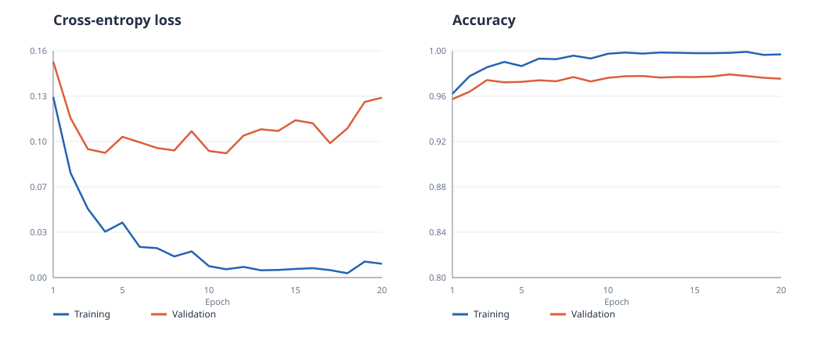

# Ariadne

Ariadne is a small educational neural-network framework built with Python and NumPy. Its tensor operations are limited to addition, subtraction, multiplication, sum, mean, ReLU, softmax, and 2D matrix multiplication; it also provides softmax cross-entropy. Tensors track these operations and compute gradients with reverse-mode automatic differentiation. An MLP trained through that system reached **97.91% accuracy on the 10,000-image [MNIST](https://yann.lecun.org/exdb/mnist/) test set**.

That result comes from the default run with seed 42. We split the original 60,000 training images into 55,000 for training and 5,000 for validation. Validation accuracy selected epoch 17 of 20; the selected checkpoint was then evaluated once on the test set.

## Run the experiment

With Python 3.10 to 3.13 and internet access, run this from the repository root:

```bash
./reproduce.sh
```

The script creates `.venv`, installs pinned NumPy, runs the finite-difference gradient tests, downloads and verifies MNIST, and trains the MLP. It writes `results/history.csv`, `results/curves.svg`, `results/summary.json`, and `results/best_model.npz`. The first run downloads about 12 MB of compressed data. To train again without reinstalling dependencies, run `.venv/bin/python -m ariadne.experiment`. Use `.venv/bin/python -m ariadne.experiment --help` to see the optional settings.

The default model has layers `784 → 256 → 128 → 10`, with ReLU after each hidden layer. It starts with He-normal weights and zero biases. Training uses Adam at a learning rate of 0.001 for 20 epochs, in batches of 128. Pixels are converted to `float32` in `[0, 1]`. `numpy.random.SeedSequence` gives the train/validation split, weight initialization, and epoch shuffling separate random generators. Results may vary slightly across BLAS implementations because floating-point matrix multiplication can differ.



## Use the saved model

Create the environment with `python3 -m venv .venv` and `.venv/bin/python -m pip install -r requirements.txt`, then run this with `.venv/bin/python` from the repository root. The checkpoint is included in the repository; `load_mnist` downloads the test images if needed.

```python
from pathlib import Path
import numpy as np

from ariadne import MLP, Tensor
from ariadne.mnist import load_mnist

model = MLP((784, 256, 128, 10), np.random.default_rng(0))
with np.load("results/best_model.npz") as saved:
    for index, parameter in enumerate(model.parameters()):
        parameter.data[...] = saved[f"parameter_{index}"]

_, _, test_images, test_labels = load_mnist(Path("data/mnist"))
prediction = int(model(Tensor(test_images[:1])).data.argmax(axis=1)[0])
print(f"prediction: {prediction}; label: {int(test_labels[0])}")
```

For your own digit, pass a `(1, 784)` array of `float32` pixel values in `[0, 1]` to `Tensor`.

## How backpropagation works

Each `Tensor` holds a NumPy array, a gradient slot, its parent tensors, and a backward rule. Matrix multiplication, addition, multiplication, reduction, and ReLU create tensors that record how to pass a gradient to their parents. The forward pass builds a computation graph. Starting from a scalar loss, `backward()` visits its dependencies in topological order and applies the rules in reverse. When several paths reach the same tensor, their gradients are added.

For a linear layer `Y = XW + b`, let `G = ∂L/∂Y` be the incoming gradient. Then `∂L/∂X = GWᵀ`, `∂L/∂W = XᵀG`, and `∂L/∂b = ΣᵢGᵢ`. The forward pass broadcasts the bias across the batch, so its backward rule sums over that dimension. `_unbroadcast` handles the same reduction for other dimensions expanded by NumPy broadcasting. ReLU passes the gradient through positive inputs and zeroes it elsewhere.

`Tensor.softmax()` shifts its input before exponentiation to avoid overflow. Given probabilities `p` and an incoming gradient `g`, its backward rule computes the Jacobian-vector product `p ⊙ (g − Σ(g ⊙ p))` directly. Training uses a fused softmax/cross-entropy function. For logits `z` and target class `y`, the loss is `log(Σⱼ exp(zⱼ − max(z))) − (zᵧ − max(z))`, averaged over the batch. The gradient for each logit is `(p − one_hot(y)) / batch_size`.

`SGD` updates parameters with `θ ← θ − ηg`. `Adam` tracks exponential moving averages of the gradient and its square, corrects their initialization bias, and applies `θ ← θ − ηm̂/(√v̂ + ε)`. The MLP is a sequence of `Linear` and `ReLU` layers trained through the tensor graph. NumPy supplies array storage and arithmetic.

## Tests and results

`python -m unittest discover -s tests -v` compares gradients with centered finite differences for broadcasting, matrix multiplication, ReLU with shared graph paths, softmax, stable cross-entropy, and every parameter of a small MLP. The tests also check SGD and Adam updates. The default run's measured results are in [summary.json](results/summary.json), with per-epoch values in [history.csv](results/history.csv).

MNIST comes from the [CVDF mirror](https://github.com/cvdfoundation/mnist) or a secondary mirror. Each download is checked against its known MD5 digest before the IDX headers are parsed. Git ignores the downloaded data; the default checkpoint, metric, and plot files are committed.

## License

Ariadne is licensed under the [MIT license](LICENSE).
